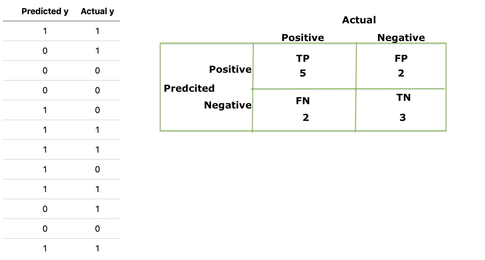

## Assessment 04 Review Questions

#### Topics Assessment 4 will cover:

    KNN
    Cross Validation
    Predictive/Inferential Linear Regression
    Regularization
    Decision Rules
    Logistic Regression

1. What are the assumptions behind OLS linear regression?

Primary Assumptions
    - Linearity: the relation between x & y should be modeled with a linear function; in other words model is a linear function of transformed features
    - Linear Independence of features or No multicollinearity: multicollinearity is when we have high correlation of a feature to the linear combination of other features. Features should not be derived from one another
    - Independence of data: so that the regression model improves accuracy as we add more observations
    - Normal distribution: parameters/coefficients of linear regression should be normally distributed as /beta is a random variable 
    - Homoscedasticity: the variance of errors/noise should not be dependent on x. 

Secondary Assuptions 
    - No influential outliers 

Why should we care about assumptions?

If the assumptions aren’t met, it reduces the reliability of the model itself and the results may not be valid or meaningful.

2. What are some metrics for linear regression goodness of fit, and what do they mean?

Regression metrics
RSS: residual sum of sqares; this error metrics is dependent on n or len(y_true) 
```python
return np.sum((y_true - y_pred)**2)
```
MSE: measures goodness of fit; measures how much the prediction deviates from true values while heavily penalizing large deviation ;provides answer in a squared unit
```python
return np.sum((y_true - y_pred)**2) / len(y_true)
```
    RMSE: brings back to the original unit measurement by takin the square root of MSE
MAE: goodness of fit measure with an absolute value rather than sq.; equal error weight to all
```python
return np.sum(abs(y_true - y_pred)) / len(y_true)
```
R^2/adjusted R^2: how much of the variability can be explained by the model; given in the range of [0,1], higher is better (aka as RSS/TSS approaches 0)
```python
return 1 - RSS/TSS 
return 1 - np.sum((y_true - y_pred)**2)/ np.sum((y_true - np.mean(y_true))**2)
```

3. In the context of machine learning, what are bias and variance?  And what is the bias-variance trade-off?

bias: the average difference between the expected y values and predictions
variance: how far the training model is from what it would be if we had the population

trade-off: as the complexity of the model increases, bias starts decreasing and variance starts increasing 
underfit model has high bias and low variance while overfit model has high variance and low bias

4. Detail high bias and high variance for the following two models. How would you address each problem? 

    * KNN: <br>
Starting out with a low hyperparameter, k, will most likely give us an underfit model with high bias and increasing k high can lead to a very specific fit, therefore balancing k with np.sqrt(n) can adderess the high bias and high variance problem. Therefore, in summary tunning the hyperparameter k
    * Linear regression: <br>
Balancing the number of features and the interaction of the features can address with the complexity problem and find the best fit beta coefficients

5. Explain the process you would use to make a generalizable supervised learning model. 
   In the process, compare/contrast cross-validation using a single train-test split 
   to k-fold.  What advantage does k-fold have over a single train-test split?
   Is k-fold always best?

Cross-validation: is a technique for assessing the generalization of stats analysis on independent data-set used for model evaluation and model comparisons.

A single train-test split provides one observation of the training data stats prior to testing on the holdout data while k-folds train-test split allows to 
    - run k experiments; k different ways the samples interact with one another 
    - run k tests and finding the average results on k-testing tests to get a better sense of how the model performs on average without compromising the "unseen data" to get more data for the model 

6. Identify which term belongs with each scenario. 

    TERMS = [Underfit, Back to the drawing board, Great, Overfit]

    - Training results good testing restults good: Great
    - Training results good testing restults bad: Overfit
    - Training restults bad testing restults bad:  Underfit
    - Training restults bad testing restults good: Back to the drawing board
    


7. A coworker explained his machine learning workflow to you, and you have a suspicion that there's 
   something wrong about it:

    "After I got the data I standardized the columns and did a train-test split to make a hold-out set. Then used 5-fold cross-validation to determine the best model hyper-parameters. I used RMSE as my model comparison metric. I took the hyper-parameters I got from cross-validation and trained a model on the full training set. Then I got my RMSE on the hold-out set and it did way better than my training set. I just figured I made a great model... " 

    Where did he go wrong?

Issue is training model on a full training set is violating the predicting on unseen dataset, hence why it can possibly perform better on the hold-out set.


8. What is the curse of dimensionality in machine learning?  What can you do to address it?

Increasing the number of features and hence the complexity of the model, will increase the performance upto a certain extent, then the model loses it optimal performance, becomes and slows down in performance. It's also the case that as we increase features, the average distance between points increase exponentially<br>
Solution: find the optimal # of features by measuring various error metrics, and finding the trade-off with bias and variance

9. Considering Lasso and Ridge Regression, how are they different? How are they similar? 

Both Lasso and Ridge regression are regularization methods to prevent overfitting. They both add a hyperparameter lambda to reduce variance as compareed to the least squared fit. Both have similar formula Ridge squares parameters except for y-intercept while Lasso takes the absolute value. 

Difference is ridge shrinks the parameters close to zero and concentrates on the variables that are useful while lasso shrinks to zero and eliminate variables that are useless for prediction. Ridge is better on dense models while lasso on sparce models 


10. Considering L1 and L2 regularization. What are they and in what situations might you use one instead of the other?
L2 (Ridge): when comparing top valuable features 
L1 (lasso): when determining which features to eliminate


11. Draw a confusion matrix for the following binary predictions.

    |  | Predicted y | Actual y| 
    |:----------:|:------------:|:----------:|
    |  | 1 | 1 |  
    |  | 0 | 1 |  
    |  | 0 | 0 |  
    |  | 0 | 0 |  
    |  | 1 | 0 |  
    |  | 1 | 1 |  
    |  | 1 | 1 |  
    |  | 1 | 0 |  
    |  | 1 | 1 |  
    |  | 0 | 1 |  
    |  | 0 | 0 |  
    |  | 1 | 1 |  



12. Identify which term belongs with each bullet and give an example scenario for each. 

    TERMS = [Accuracy, Recall, Precsion, F1-score]
    
    * I want to minimize False Negtives TPR/Recall e.g, disease 
    * I have balanced classes and care about all: TP, TN, FP, FN accuracy e.g, 
    * I want to minimize False Positives PPV/Precision e.g, spam
    * I want to minimize both FN and FP e.g., F1-score marketing different content for target group and non-target group

13. How is a ROC curve generated?  What does it show?
ROC is generated plotting the TPR against the FPR with the aim of getting a curve that is above the AUC 0.5 threshold. ROC value ranges from 0, 1 with 0.5 representing average if we were to do a random guess and 1 being unreasonably good model

14. What are the similarities and differences between linear and logistic regression and how do you interpret the coefficients in each case?

Both evaluate the best fit line to data points based on the given metrics and the error metrics we use to measure linear regression is applicable to logistic regression as well. And increase 1 unit of x1 holding all other constant will change y^ by some factor of B1.
Differences is the factor of change for y^ is by B1 and e^B1 for linear and logistic respectively. Logistic is the probabily classification prediction and thus ranges from 0, 1. It uses maximum likelihood function to find Beta coefficients.  

15. SQL: Given table `houses` below, write a query to...

| id | sqft | beds | neighborhood | type | sale_price |
|:----------:|:------------:|:----------:|:----------:|:-----------:|:-----------:|
| 1 | 1150 | 2 | prospect-park | townhome | 244052 |
| 2 | 2600 | 3 | calhoun-isles | single_family | 609536 |
| 3 | 860 | 1 | uptown | condo | 472993 |
| 4 | 1320 | 3 | north-loop | townhome | 309485 |
| 5 | 1030 | 2 | downtown | townhome | 456141 |
| 6 | 3000 | 3 | uptown | single_family | 544431 |
| 7 | 1400 | 2 | longfellow | condo | 305314 |
| 8 | 3000 | 4 | longfellow | single_family | 485802 |
| 9 | 1700 | 3 | stephens-square | single_family | 337029 |

  * Return the average number of bedrooms and square footage for each type of home in the longfellow neighborhood.
```sql
SELECT avg(beds), avg(sqft)
FROM houses
WHERE home = 'longfellow'
GROUP BY type;
```

  * Return the average sale price for each  neighborhood and home type.

```sql
SELECT avg(sale_price)
FROM houses 
GROUP BY neighborhood, type;
```