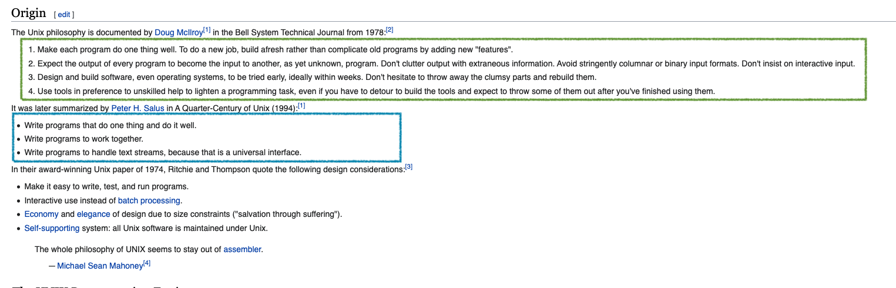

## Week 1 Review Questions

1. What is `git`, and why is it useful to you as a Data Scientist?

`git` is a version control system that facilitates multiple Data Scientists/developers to be able to work on the same file. It maintains history by tracking all changes.

2. What is the difference between `git` and `Github`?  What does `Github` provide 
   that is useful to you as a Data Scientist and developer?

`Github` is the company that provides hosting for software development and vcs that uses Git. It stores codes and files remotely in the cloud.

3. There is a common `git` expression: 'ABC'.  What does it mean, and why is it 
   good advice?

'ABC', a git expression, stands for Always Be Committing. It is a useful technique to easily revert back when needed. 

4. What is Unix?  How has the Unix philosophy influenced software development?

Unix is an operating system that is widely used by the developing community. It's main differentiation factor is that it is an open source and is distributed via MacOS and Linux. 

Unix Philosophy:

* minimalistic software development (build new job afresh rather than add new features on old programs)
* modularity and reusability



5. You try to run an application, but are told that you don't have permission to
   access a certain file.  Describe the steps you would use to solve 
   this problem (allowing access to the file).

I will first run the `ls -l` command and look at the first characters listed at the beginning of the particular application I am trying to run. If I do not have the correct access, I will change the permission by running `chmod o=rwx <file name>`.

5. Compare and contrast functional and object oriented programming paradigms.  
    Then discuss the the 3 pillars of OOP and how they relate to Python.

Functional programming is creating and applying a function whereas object oriented is creating an object with attribute and methods.

OOP Pillars:

* abstraction: no need to know how it works
* inheritance: can build on an existing class while it takes the attributes and methods from the original class
* encapsulation: hidding the inner working of the class and only exposing the necessary features
* polymorphism: provision of a single interface for similar classes

6. What are some distinguishing characteristics of the Python programming 
   language?  

* supports many lparadigms (function, OOP, imperative)
* rapid REPL(read evaluate print loop)
* code readability (use of whitespace vs braces/brackets)
* efficient syntax / shorter lines
* large dev community (comprehensive libraries)


7. What are some differences between Python 2 and Python 3?  Why was Python 3
   developed?


"reduce feature duplication by removing old ways of doing things"

8. List major data structures in Python.  Which data structure(s) would you use to
   in each of the following situations, and why:

int - positive and negative integers and zero
float - real numbers represented in decimals
str - ordered characters
complex - imaginary numbers
bool - true/false
tuple - immutable, ordered
list - mutable, ordered
set - unordered, unique items
dict - unordered pairs

  * Unchanging sales records - tuple

  * A customer database where changing information, such as address, email,
  and purchases are associated with a given customer name. - dict 

  * Driving waypoint locations between arbitrary points A and B. -numpy arrays

  * The unique words used in a text corpus. -str set 

  * A search engine that returns results quickly for a given search term. - dict

9. Write a one line list comprehension to perform the following matrix
   multiplication (A dot product B).  Describe how it works. How would you check
   it with NumPy?
```python
    A = [ [ 2, 4], [ 1, 7], [-1, 8] ]

    B = [ [3, 2, -5, 6],  [1, -3, 4, 8] ]

```

``` python

result = [[sum(a*b for a,b in zip(A_row,B_col)) for B_col in zip(*B)] for A_row in A   ]

import numpy as np

AB = np.dot(A,B)
```

10. The `data` folder contains tweets from Elon Musk in March of 2017. Write a
    Python TweetData class to hold Elon's tweets.  The class should have at least two
    attributes: .raw and .cleanedtweets.  The .raw attribute should hold the raw data (3
    columns and 120 rows).  The .cleanedtweets attribute should only have 1 column
    (but still 120 rows) containing only lowercase alphanumeric characters present
    in the 3rd column of the raw tweets.  Feel free to use whatever additional 
    attributes or methods you need to make the class and an Elon Tweets object.

```python

class ElonTweet():
    
    def __init__(self, file_path):
        self.file_path = file_path
        self.raw = pd.read_csv(self.file_path)
    
    def cleaning(self):
        text_col = self.raw.loc[:,'text']
        punc = '?,.<>";:[]}{-!@$%^&*()+=-_`/'
        
        def rm_punc(x):
            return ''.join([char for char in x.lower() if char not in punc])
        
        self.cleanedtweets = text_col.apply(rm_punc)

if __name__ == '__main__':
    filepath = 'filepathhere'
    tw = ElonTweet(file_path)
    raw_tweet = tw.raw
    tw.cleaning()
    clean_tweet = tw.cleanedtweets


```